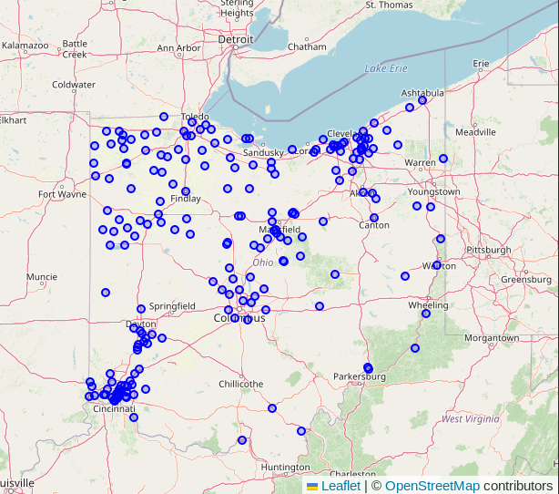

# PostGIS Geo Faker

The project creates fake store and customer data with geospatial
components based on OpenStreetMap.  The use of OpenStreetMap data
as a starting point provides a sense of realism. The use of `random()`
and to generate fake data avoids privacy concerns.

## Load OpenStreetMap Data

Load the region/subregion you want using the PgOSM Flex Docker image.
These instructions are modified from [PgOSM Flex's Quick Start](https://github.com/rustprooflabs/pgosm-flex#quick-start) section. The following
loads the data into a PostGIS enabled database in a `pgosm-flex-faker`
Docker container available on port 5433.


```bash
mkdir ~/pgosm-data
export POSTGRES_USER=postgres
export POSTGRES_PASSWORD=mysecretpassword

docker stop pgosm-faker
docker build -t rustprooflabs/pgosm-flex-faker .

docker run --name pgosm-faker -d --rm \
    -v ~/pgosm-data:/app/output \
    -v ~/git/pgosm-flex-faker/:/custom-layerset \
    -v /etc/localtime:/etc/localtime:ro \
    -e POSTGRES_PASSWORD=$POSTGRES_PASSWORD \
    -p 5433:5432 -d rustprooflabs/pgosm-flex-faker

docker exec -it \
    pgosm-faker python3 docker/pgosm_flex.py \
    --ram=8 \
    --region=north-america/us \
    --subregion=nebraska \
    --layerset=faker_layerset \
    --layerset-path=/custom-layerset/
```


After the data completes processing, load the PgOSM Flex Faker database structures.
This is done using Sqitch.


```bash
cd pgosm-flex-faker/db
sqitch db:pg://$POSTGRES_USER:$POSTGRES_PASSWORD@localhost:5433/pgosm deploy
```

Connect to the database and call this stored procedure.  The generated data
is left in a temp table, each run of the stored procedure will produce new,
random results.

```sql
CALL pgosm_flex_faker.location_in_place_landuse();
SELECT COUNT(*) FROM faker_store_location;
```

Save the data somewhere you want, in a non-temp table.

```sql
CREATE TABLE AS my_fake_stores AS
SELECT *
    FROM faker_store_locations
;
```


Version 1


Version 2




